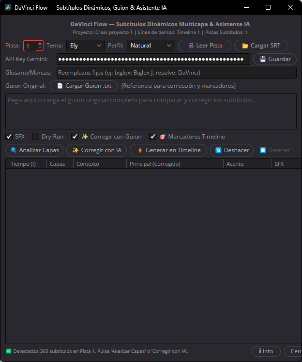

# DaVinci Flow

DaVinci Flow es una automatización modular en Python para DaVinci Resolve 21 que transforma subtítulos nativos en títulos dinámicos multicapa, jerarquía visual y propuestas de efectos sonoros (SFX), manteniendo el flujo de edición no destructivo y 100% reversible.

## 📸 Capturas de Pantalla



---

## 🚀 Capacidades Principales

- **Lectura no destructiva**: Ingesta de subtítulos nativos de Resolve sin alterar clips originales.
- **Clasificación semántica determinista**: Desglose en hasta 3 capas de texto (`DF_CONTEXT`, `DF_MAIN`, `DF_ACCENT`) e intención comunicativa (`statement`, `question`, `exclamation`, `emphasis`, `negation`).
- **Brand Guard y temas oficiales**: Soporte estricto para los temas **Ely** y **Aurora** con validación de paletas HEX y fuentes tipográficas oficiales.
- **Plantillas Fusion (.setting)**: Generación limpia de nodos TextPlus y composiciones gráficas.
- **Motor SFX inteligente**: Propuestas de audio catalogadas con autoría y licencias auditables, control de densidad y soporte para rangos `[SFX_OFF]`.
- **Idempotencia y regeneración parcial**: Detección de subtítulos modificados/añadidos mediante huellas SHA-256 para actualizar únicamente los bloques necesarios.
- **Reversión segura**: Retirada controlada de los elementos generados por DaVinci Flow sin tocar pistas ajenas.

---

## 🏛️ Arquitectura Modular

```text
src/davinci_flow/
├── __main__.py              Entrada CLI principal (planificación, generación, auditoría)
├── application.py           Coordinación de casos de uso del producto
├── errors.py                Jerarquía de errores controlados
├── generation/              Plan de generación, diffs, plantillas Fusion y registros
│   ├── fusion_template.py   Generador de .setting y conversión de color
│   ├── plan.py              Modelo GenerationPlan versionado (1.0.0) y persistencia
│   ├── reconciler.py        Motor de reconciliación y diff de subtítulos
│   └── record.py            Auditoría de clips generados y reversión
├── resolve/                 Adaptadores exclusivos para DaVinci Resolve API
│   ├── client.py            Conexión segura y detección de sesión
│   ├── subtitle_reader.py   Lector y normalizador de pistas
│   ├── timeline_writer.py   Inserción y reversión en pistas dedicadas
│   └── track_manager.py     Gestión de pistas DF_CONTEXT, DF_MAIN, DF_ACCENT, DF_SFX
├── sfx/                     Biblioteca y motor de efectos de sonido
│   ├── catalog.py           Descriptor auditable AssetDescriptor y catálogo
│   └── engine.py            Motor de propuesta y perfiles de densidad
├── subtitles/               Modelos de dominio, normalizador y clasificador
│   ├── block.py             CaptionBlock con roles y trazabilidad
│   ├── classifier.py        Clasificador de capas semánticas en español
│   ├── fingerprint.py       Huellas SHA-256 e identificadores estables
│   ├── model.py             SubtitleCue nativo
│   └── normalizer.py        Normalizador ortográfico y de caracteres especiales
└── themes/                  Tokens oficiales y Brand Guard
    └── tokens.py            ThemeTokens, temas Ely/Aurora y validación estricta
```

---

## 🛠️ Requisitos del Entorno

- **Sistema Operativo**: Windows 11 (64 bits).
- **Entorno Host**: DaVinci Resolve 21 (Studio o Free con scripting habilitado).
- **Stack**: Python 3.11 de 64 bits.
- **Dependencias externas**: Ninguna (librería estándar de Python y API de Resolve).

---

## 📖 Guía de Uso por Terminal

Configurar la ruta del paquete:

```powershell
$env:PYTHONPATH = "$PWD\src"
```

### 1. Información y Acerca de
```powershell
python -m davinci_flow --about
```

### 2. Previsualizar el Plan de Capas (Modo Seco)
```powershell
python -m davinci_flow --plan --track 1 --theme ely --profile natural
```

### 3. Exportar el Plan Calculado a Archivo JSON
```powershell
python -m davinci_flow --plan --export-plan "temp/plan_generacion.json"
```

### 4. Simulación de Generación (Dry-Run)
```powershell
python -m davinci_flow --generate --dry-run --theme ely
```

### 5. Comparar y Reconciliar contra un Plan Previo
```powershell
python -m davinci_flow --reconcile "temp/plan_generacion.json"
```

---

## 🧪 Ejecución de Pruebas Automatizadas

```powershell
$env:PYTHONPATH = "$PWD\src"
python -m unittest discover -s tests -v
```

---

## 👤 Autor y Licencia

- **Autor**: biglexj (2026)
- **Licencia**: MIT
- **Donaciones Oficiales**: [https://www.biglexj.com/donaciones](https://www.biglexj.com/donaciones)
- **Buy Me a Coffee**: [https://buymeacoffee.com/biglexj](https://buymeacoffee.com/biglexj)
- **GitHub**: [https://github.com/biglexj](https://github.com/biglexj)
