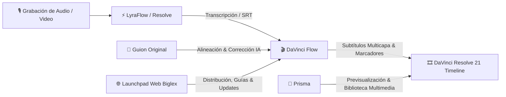

# 🌐 Interconexión con la Web & Launchpad de Biglex

Este documento define la correlación técnica y de producto entre **DaVinci Flow** y la plataforma web oficial de Biglex ([https://biglexj.com](https://biglexj.com)).

---

## 1. Ficha Técnica en el Launchpad Web (`/desarrollo`)

En el Launchpad de aplicaciones de Biglex, DaVinci Flow está registrado bajo la siguiente ficha de metadatos:

```typescript
// Configuración en DeveloperPage.astro / appsData.ts
"davinci-flow": {
    title: "DaVinci Flow",
    slug: "davinci-flow",
    category: "Multimedia",
    status: "Experimental",
    statusKey: "experimental",
    tone: "coral",
    icon: "lucide:video",
    description: "Automatización avanzada para DaVinci Resolve 21: subtítulos dinámicos multicapa, corrección con guion por Gemini IA y marcadores en línea de tiempo.",
    launchUrl: "/desarrollo/davinci-flow",
    meta: "DaVinci Resolve 21 · Python 3.11 · IA Gemini"
}
```

### Elementos Visuales
- **Categoría**: `Multimedia` (filtro activo en el Launchpad junto a Prisma, Luna Fetch y LyraFlow).
- **Badge de Estado**: `Experimental` con tono `coral` representativo de la suite de video.
- **Icono**: Cámara de cine / Video (`lucide:video`), armonizado con la paleta de DaVinci Resolve.

---

## 2. Sinergia en el Ecosistema Biglex

DaVinci Flow forma parte de la cadena integral de producción de contenido de Biglex:



1. **LyraFlow & DaVinci Resolve**: Transcriben las pistas de voz y generan la base de subtítulos.
2. **DaVinci Flow**: Aplica el motor de inteligencia artificial (Gemini) para cotejar contra el guion original del creador, corregir palabras erróneas/jergas y separar el texto en capas visuales dinámicas.
3. **Prisma**: Administra la biblioteca de medios, recursos gráficos y fondos.
4. **Launchpad Web**: Centraliza las notas de versión, guías de usuario y canal de donaciones.

---

## 3. Protocolo de Sincronización de Versiones y Release Notes

Cuando se publica una nueva versión de DaVinci Flow:
1. Se actualiza `RELEASE_NOTES.md` con el formato canónico de Docs.
2. Se actualiza `RELEASE_MESSAGE.md` con el anuncio público para la comunidad.
3. La ficha en la web (`DeveloperPage.astro` y base de datos Supabase de aplicaciones) refleja la versión, estado (Experimental / Actualizada) y notas de cambios.
4. El diálogo `ℹ️ Info` dentro de la interfaz gráfica de DaVinci Resolve enlaza a la web oficial y al canal de donaciones (`https://www.biglexj.com/donaciones`).
